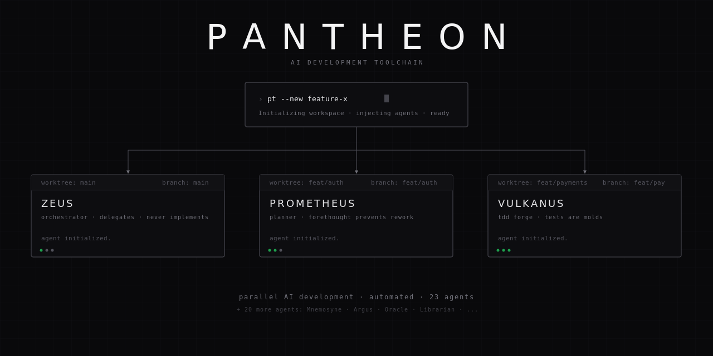

# Pantheon



Most people run one agent for everything. One context window trying to be architect, TDD engineer, planner, and reviewer at once. That's a monolith.

Pantheon is a scaffold of 23 specialized agents — each with one job, none sharing context. Defined in files, versioned in git, improved like code.

---

## Agents

| Agent | Role |
|-------|------|
| **Zeus** | Orchestrates multi-agent workflows |
| **Prometheus** | Plans architecture before code |
| **Vulkanus** | TDD — writes tests first, code second |
| **Mnemosyne** | Manages project memory and context |
| **Argus** | Code review and quality gates |
| **Oracle** | Architecture decisions, hard debugging |

> [All 23 agents →](docs/agents.md)

---

## Quick Start

```bash
# 1. Create your workspace
gh repo create my-workspace --template ihorkatkov/pantheon --private --clone
cd my-workspace

# 2. Adopt your product repo
make adopt REPO=git@github.com:org/my-product.git

# 3. Start working
pt
```

OpenCode opens in `worktrees/main/`. Press **Tab** to switch agents.

```bash
# Create a feature branch worktree
pt --new my-feature
```

---

## How It Works

```
your-workspace/
├── .opencode/agents/      ← 23 agent definitions (edit, commit, ship)
├── AGENTS.md              ← generated project context for all agents
├── worktrees/
│   ├── main/              ← your product repo
│   └── my-feature/        ← isolated branch worktree
└── pt                     ← entrypoint
```

One workspace wraps your product repo. Every agent reads the same `AGENTS.md`.
When you improve an agent — every team member gets the update on `make update`.

> Treat agents like code. Version them. Review them. Ship them.

---

## Links

[Docs](docs/) · [Agent Catalog](docs/agents.md) · [Configuration](docs/configuration.md) · [Contributing](CONTRIBUTING.md)

---

MIT © ihorkatkov
